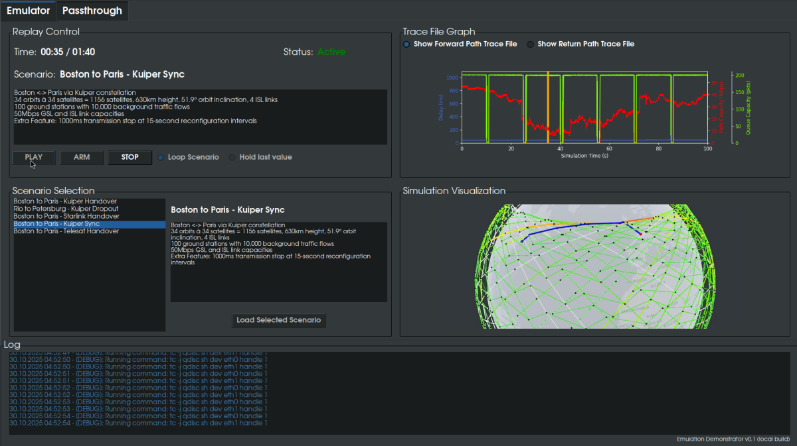
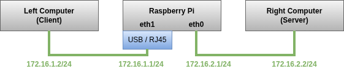
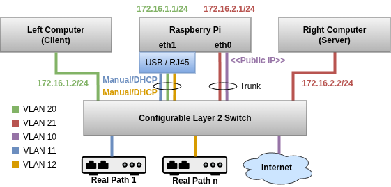

# Emulation Demonstrator

This repo provides a bootable Raspberry Pi disk image wrapping the [TheaterQ](https://github.com/cs7org/TheaterQ) kernel module for dynamic link emulation.
The Raspberry Pi is connected between two real computers, replaying link characteristics provided by a user in a given file format using a USB drive.
A simple GUI allows for easy control of the tool.
The tool allows performing end-to-end tests of different (non-online) applications with humans-in-the-loop on the real computers, e.g., video streaming.

")


The following hardware is required for a simple emulation setup:
- A Raspberry Pi 4 or 5 with at least 1GB of RAM
- A USB3 to RJ45 adapter with mainline Linux support
- An external display that can be connected to the Raspberry Pi using HDMI
- A mouse to control the frontend
- Two real systems, e.g., laptops, with Ethernet ports
- Some cabling

It is also possible to integrate real network paths. 
You can switch between the network paths and the emulator using the frontend. 
To integrate real network paths, additional things are required:
- A public IP address that is directly routed to the Raspberry Pi
- A configurable Layer 2 switch (with VLAN/Trunk support)

## Hardware Setup

The Emulation Demonstrator is primarily intended for the use without real networks paths, however, for direct comparison, real paths can be integrated with some initial configuration effort.
After changing the config `frontend/config.json`, the disk image needs to be rebuilt. 
It is also possible to mount the *ROOT* partition of the SD card on another computer to change the config.
The *ROOT* partition is mounted read-only (overlayfs) while the emulator is started, therefore no persistent changes on the running system are easily possible. 
Please note that both setup currently only support IPv4.

## Simple Setup (Emulator Only)


The simple network setup allows playing back Trace Files between two computers. 
For this, neither network switch nor VLANs are required.
Connect both computers as shown above and perform the following manual configuration:
- **Left computer**: Hosts the Client software, IP: *172.16.1.2/24*, Gateway: *172.16.1.1*
- **Right computer**: Hosts the Server software, IP: *172.16.2.2/24*, Gateway: *172.16.2.1*
As soon as the emulator is started, you can use `ping 172.16.2.2` on the left computer to reach the other one.
See `frontend/config.json` to change the IP addresses, for the simple setup it is only required to touch the *general* part of the config.

HDMI-1 and HDMI-2 of the emulator will output the emulator frontend at *1080x1920* shortly after booting.

## Extended Setup (Emulator + Real Network Paths)


This setup extends the simple setup and allows integrating real network paths.
In this case, both network interfaces of the Raspberry Pi will be used in VLAN trunk mode.
Basically, the Raspberry Pi virtually connects the public IP, the Internet, to the right computer and the selected real path (e.g., a satellite modem) to the left computer.
Traffic is routed from the left computer to the public IP via the real path gateway and the Internet, and is ultimately received by the right computer.

Setup instructions:
1. Configure all VLANs as shown in the figure above. All VLAN IDs can be changed, see `frontend/config.json`
2. A public IP address (without firewall, tunneling possible) is required, it must be set statically in the config `frontend/config.json` in section *extended.public_interface*
3. Set up the real network paths, consider the section *extended.configs* in `frontend/config.json` for details.
To configure the real path endpoint using DHCP set both *address* and *gateway* to *null*.
4. The *extended.right_netns_address* must be in the same network as *general.right_interface_address*.
6. Change the file `frontend/frontend.service` to enable the extended mode as described by the comment.
5. Configure both computers as described in the simple setup instructions above. 
In this setup, the right computer is reached by its public IP address and no longer by the internal address (*172.16.2.2*).
The emulator takes care of NATting all requests to the right computer.
In this config, the right computer cannot reach the left one without a connection that was established the other way around. 
ICMP pings cannot be not NATted and are thus answered by the Raspberry Pi itself.

See `stuff/switch.cfg` for an example switch config (Aruba OS).

## Scenario Config & Trace File Format
The emulator can replay Scenarios. 
A scenario is a collection of files, consisting of a JSON config, two Trace Files in CSV format and optionally a video file.
Scenarios are supplied to the emulator from a USB drive (exFAT), where the JSON configs in the `/scenario` directory are considered.
The emulator supports USB hotplug, available/detected scenarios are listed in the frontend.

See `sample/scenarios` for examples.

### JSON Config
```json
{
    "name": "Name of the Scenario",
    "description": "A longer description shown in the frontend.\ncan be used for new lines.",
    "trace": {
        "format": "simple|extended",
        "forward": "forward_trace_file_in_the_format.csv",
        "return": "return_trace_file_in_the_format.csv"
    },
    "video": "video_file.mp4"
}
```

*trace.forward* and *trace.return* needs to be provided in the selected *trace.format*. 
The forward Trace File is used to emulate the path from the left to the right computer, the return Trace File for the emulation of the path in the other direction.
*video* is optional, set to *null* if no video is provided.

### Trace Files
Trace Files for the forward and return path are required, it is possible to set both entries to the same file.

Fields:
- **keep**: microseconds
- **latency**: nanoseconds
- **jitter**: nanoseconds, default 0
- **rate**: bits per second
- **loss**: scaled 32bit unsigned integer (0 = 0%, 4294967295 = 100%), default 0
- **dup_prob**: scaled 32bit unsigned integer (0 = 0%, 4294967295 = 100%), default 0
- **dup_delay**: nanoseconds, default 0
- **reorder_route**: Integer, default 1

#### Simple Format
```csv
keep,latency,rate,loss,limit
10000,42050000,46996000,0,200
...
```

#### Extended Format
```csv
keep,latency,jitter,rate,loss,limit,dup_prob,dub_delay,reorder_route
10000,42050000,96050,46996000,0,200,0,0,1
...
```

### Video File
An mp4 video file can be provided that is played back during Trace File replay.
The video should have the same length as the longest Trace File of the scenario (in seconds).
A frame is grabbed each second of the replay.

## Build Emulator Disk Image
This repo can be used to create a bootable disk image for Raspberry Pi SBCs using [rpi-image-gen](https://github.com/raspberrypi/rpi-image-gen/). 
The disk image contains a custom OS with all required dependencies that directly boots into the emulator frontend.

To build the disk image the use of another Raspberry Pi with a recent Raspberry Pi OS installation is highly recommended. 
After this OS is installed, check out or copy this repo to this Raspberry Pi and follow the build instructions.
Cross compilation on other hardware is possible, refer to the rpi-image-gen documentation for this.

### Manual build

1. Prepare the build environment (only required once for setup):
    ```bash
    git submodule update --init
    cd infra/rpi-image-gen
    sudo ./install_deps.sh
    ```
2. Prepare a container image to build the *TheaterQ* kernel module (only required when the upstream kernel has changed):
    ```bash
    infra/rpi-image-gen/rpi-image-gen build -S infra/build-container/. -c build-container.yaml
    podman import work/mydev/build-container.tar.gz builder:latest
    infra/rpi-image-gen/rpi-image-gen clean -S infra/build-container/. -c build-container.yaml
    ```
3. Build the *TheaterQ* kernel module Debian package (only required when the upstream kernel has changed or TheaterQ was updated):
    ```bash
    podman run --rm -v $(pwd)/infra/theaterq:/work builder:latest make -C /work prepare all
    cp infra/theaterq/theaterq.deb image/files/packages/.
    ```
4. Build the frontend Debian package:
    ```bash
    make -C ./frontend all
    cp frontend/fornend.deb image/files/packages/.
    ```
5. Build the disk image:
    ```bash
    infra/rpi-image-gen/rpi-image-gen build -S image/. -c emulation-demonstrator.yaml
    # Copy work/deploy-*/emulation-demonstrator.img to a save place
    infra/rpi-image-gen/rpi-image-gen clean -S image/. -c emulation-demonstrator.yaml
    ```
    The file `emulation-demonstrator.img` can be flashed to an SD-Card (or other Raspberry Pi boot device), e.g., using the [rpi-imager](https://github.com/raspberrypi/rpi-imager).
6. Clean up (optional)
    ```bash
    podman image prune
    rm image/files/packages/*.deb
    make -C ./infra/theaterq clean
    make -C ./frontend clean
    ```

### GitLab CI/CD Build
Have a look at the `.gitlab-ci.yml` file for further details.

## Local Development
Set up a local environment:
```bash
# Install required dependencies:
# e.g., sudo apt install python3-venv python3-pip
git submodule update --init
cd frontend
pip -m venv .venv
source .venv/bin/activate
pip install -r requirements.txt
```

Start the frontend in debug mode with verbose logging. During debug mode, sample scenarios are loaded, and no commands are executed:
```bash
cd frontend/src
python3 -m {normal|exetended} -v -d ../config.json
# If the application does not stop: CRTL+Z, kill -9 %%
```

## Sample Application
See [stuff/README.md](stuff/README.md) for a webcam example application that works with the sample scenarios in `samples/scenarios`.

## License
This project is licensed under the [GNU General Public License v3.0](LICENSE.md). For more details, see the `LICENSE.md` file or see https://www.gnu.org/licenses/.
